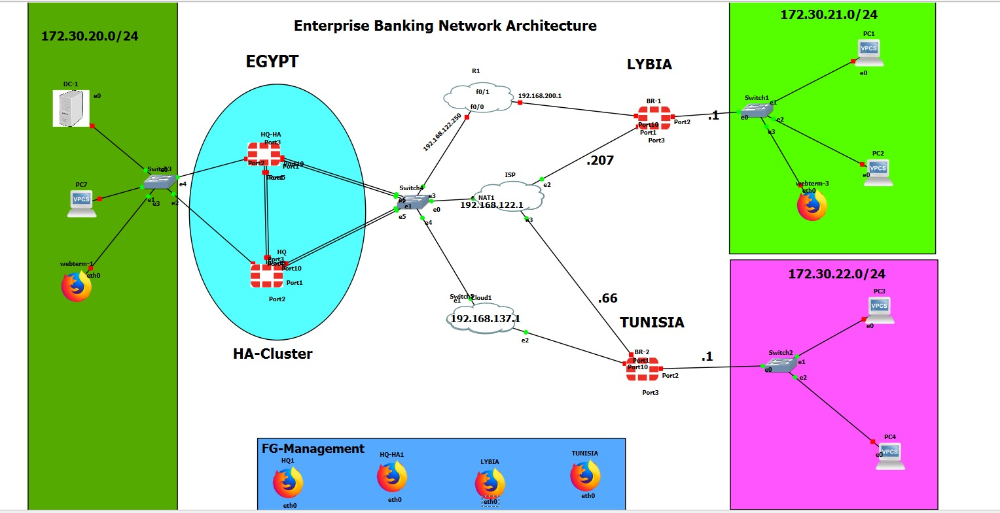

# Enterprise Banking Network Security Architecture

A simulated secure and highly available multi-site banking network built in GNS3 using FortiGate firewalls, Active-Passive High Availability (HA), LDAP authentication, Hub-and-Spoke IPsec VPN, and SD-WAN link monitoring.

## Project Overview

This lab models a banking environment with:

- **Egypt HQ** as the central hub
- **Libya Branch** and **Tunisia Branch** as remote spokes
- Simulated ISP/WAN connectivity
- FortiGate VM64-KVM firewalls
- Active-Passive HA at HQ using FortiGate Clustering Protocol (FGCP)
- Centralized LDAP / Active Directory authentication
- Hub-and-Spoke IPsec VPN between HQ and branches
- SD-WAN performance monitoring and WAN degradation detection

## Topology



## Technologies

| Technology | Purpose |
|---|---|
| GNS3 | Network simulation and lab environment |
| FortiGate VM64-KVM | Firewall, VPN, HA, routing and SD-WAN |
| FGCP | FortiGate High Availability clustering |
| LDAP / Active Directory | Centralized authentication and group-based access |
| IPsec VPN | Secure HQ-to-branch connectivity |
| SD-WAN | Link health monitoring and WAN awareness |
| ICMP / Ping | Connectivity and WAN performance testing |

## IP Addressing

| Site | Network |
|---|---|
| HQ LAN | `172.30.20.0/24` |
| Libya Branch | `172.30.21.0/24` |
| Tunisia Branch | `172.30.22.0/24` |
| Simulated ISP / WAN | `192.168.122.0/24` |
| HQ Management | `192.168.10.88` / `192.168.10.89` |
| Domain Controller / LDAP | `172.30.20.111` |

## High Availability

The HQ firewall pair is configured as an **Active-Passive HA cluster**.

- Cluster name: `HQ-Cluster`
- Primary priority: `200`
- Secondary priority: `128`
- Heartbeat interfaces: `port4`, `port5`
- Monitored interfaces: `port1`, `port2`

The lab verifies cluster formation and synchronization between the two HQ FortiGate nodes.

## Centralized Authentication

LDAP / Active Directory is used for centralized user authentication.

- LDAP server: `172.30.20.111`
- LDAP port: `389`
- Base DN: `DC=tshoot,DC=com`
- User identifier: `sAMAccountName`
- Example groups: `Bank_Employees`, `IT_Employees`, `SSO_Guest_Users`

Group-based access was tested successfully in the lab.

## Hub-and-Spoke IPsec VPN

HQ acts as the VPN hub, while Libya and Tunisia operate as spokes.

- Libya spoke: `192.168.122.207`
- Tunisia spoke: `192.168.122.66`
- HQ hub: central FortiGate cluster

The report records successful tunnel establishment and traffic flow between the sites.

## SD-WAN Monitoring

Branch FortiGate devices monitor their WAN links using SD-WAN performance checks.

The lab includes:

- Performance SLA monitoring
- Latency measurement
- Jitter measurement
- Packet-loss detection
- WAN degradation testing

An extended ping test demonstrated normal latency in the approximately **5–50 ms** range, with an observed spike to approximately **620 ms** and two timeouts, allowing WAN degradation to be identified.

## Validation Results

| Test | Result |
|---|---|
| HA cluster formation | PASS |
| LDAP authentication | PASS |
| Group-based access | PASS |
| Libya → HQ connectivity | PASS — 0% loss |
| Tunisia → HQ connectivity | PASS — 0% loss |
| Internet access via HQ | PASS |
| IPsec tunnel status | PASS |
| SD-WAN SLA | PASS |
| WAN degradation detection | PASS |

## Repository Structure

```text
.
├── README.md
├── .gitignore
├── configs/
│   ├── README.md
│   └── fortigate/
│       ├── hq-cluster.conf
│       ├── libya-branch.conf
│       └── tunisia-branch.conf
└── docs/
    ├── architecture.md
    ├── project-report.pdf
    ├── security-notes.md
    ├── testing/
    │   └── testing-and-results.md
    └── topology/
        └── topology.jpeg
```

## Configuration Files

The FortiGate configuration exports under `configs/fortigate/` are **sanitized public versions** intended for study and portfolio review. Sensitive credentials, private keys, certificates, HA passwords, and IPsec pre-shared keys have been removed.

They should therefore be treated as reference configurations rather than production-ready imports.

## Documentation

- [Architecture](docs/architecture.md) — concise technical architecture and design decisions.
- [Testing & Results](docs/testing/testing-and-results.md) — validation summary.
- [Security Notes](docs/security-notes.md) — handling sensitive configuration data safely.
- [Project Report](docs/project-report.pdf) — full academic project report.

## Future Improvements

- Active-Active HA
- Multi-Factor Authentication (MFA)
- Application-aware SD-WAN policies
- Centralized logging and SIEM integration using FortiAnalyzer / equivalent tooling

## Disclaimer

This repository documents an academic/virtual lab environment created for learning, testing, and portfolio purposes. It does not contain production banking data and is not intended for deployment in a live banking environment.
